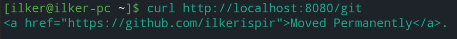

# URL Shortener with Golang

## Auth Command
```
gcloud auth application-default login --scopes=openid,https://www.googleapis.com/auth/userinfo.email,https://www.googleapis.com/auth/cloud-platform,https://www.googleapis.com/auth/spreadsheets.readonly
```

## Example Sheet

| shortcut  | url     |
| :-------- | :------- |
| `git`     | `https://github.com/ilkerispir/` |

### Example request & redirect URL

http://localhost:8080/git -> https://github.com/ilkerispir/


